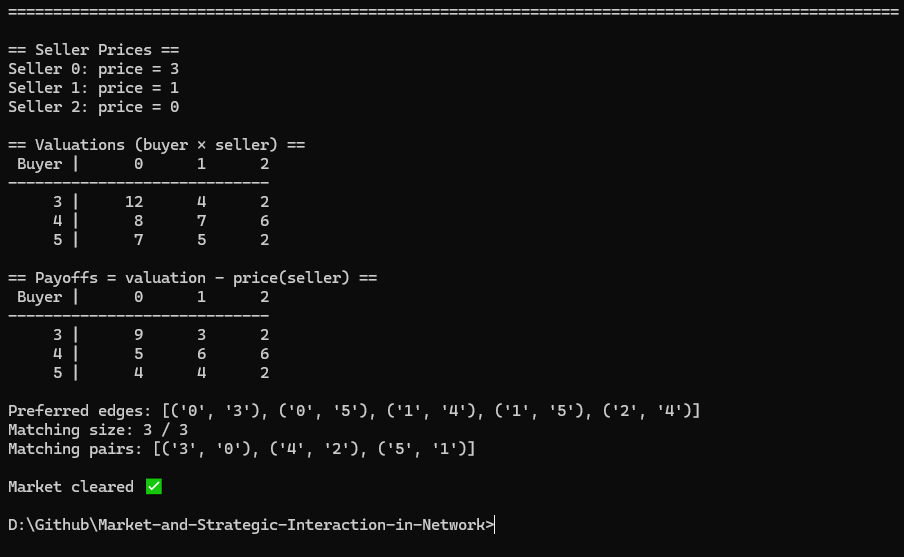
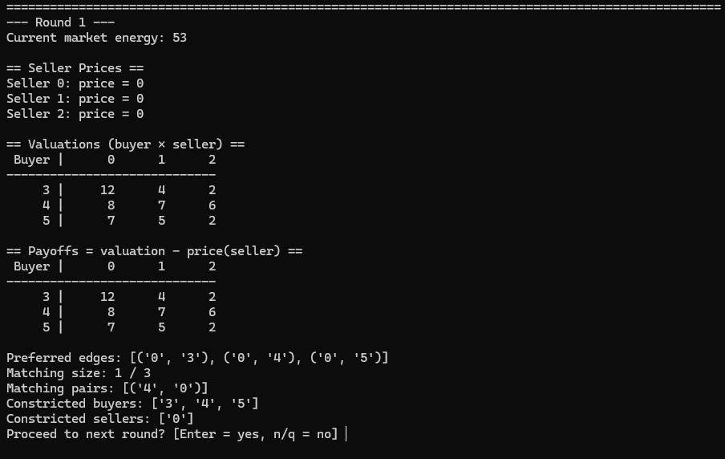

# Market-and-Strategic-Interaction-in-Network
## Mo Gibson and Philip Tran
The purpose of this assignment is to enhance our understanding of the market-clearing algorithm by executing a file that reads file market.gml (Graph Modelling Language or .gml) to describe the bipartite graph structure of sellers and buyers.

## Setup Instructions
This file is in python, so if  running on Linux or in a virtual environment, make sure to install the Tk backend for Matplotlib:
sudo apt-get install python3-tk

There must be a .gml file in the current directory. We use market.gml, but you can use any file name, just use that instead of market.gml whenever referenced:
    python market_strategy.py market.gml [OPTION]

Following functions fall under the OPTIONS category, and below details the return information for each function:
- '--plot': this tells the program to show a visual of the market clearing. when called alone it simply prints the final, perfect graph or the final constricted set when the total potential energy is gone.

- '--interactive': this allows the user to see in the terminal the buyer's payoffs and the constricted set for each round. If '--plot' is called, then each round is plotted.

- [NULL]: if no additional arguments are given then the program just prints the final market clearing result to the terminal

## Sample Command-Line Usage
    python market_strategy.py market.gml

    
    python market_strategy.py market.gml --plot
     
    
    python market_startegy.py market.gml --interactive
     
     
    
    python market_strategy.py market.gml --plot --interactive
    
    
    
    

## Explaination of Approach
Both functions require reading the graphs, finding the seller's prices, finding the buyer's valuations, and turning this into a matrix (2D array) to make it easier to track and find each buyer's preferred match.

- '--plot': The purpose of this function is to visualize the graph. In class, we redrew multiple graphs each time we had to update the seller's price. This function is supposed to show that visualization.
    --plot can be broken into 2 parts:

        1. Finding the payoffs and drawing the sets
            run_clearing_until_equilibrium: returns the end seller's prices, the buyer's payoffs, and a list of edges connecting buyers and sellers

        2. Drawing the graph to reflect the information
            draw_graph: uses the information passed in run_clearing_until_equilibrium to show in a bipartite graph

- '--interactive': The purpose of this function is to show the proof behind the result of the final graph. This is similiar to the calculations and work we did in class for examples.

    Demonstrates the algorithm step-by-step, mirroring the calculations we worked through manually.
At each round, the program prints:

    Seller prices

    Buyer valuations and payoffs

    The current preferred edges and matching

    Constricted sets (if any)
    Then it asks the user whether to continue to the next round.
